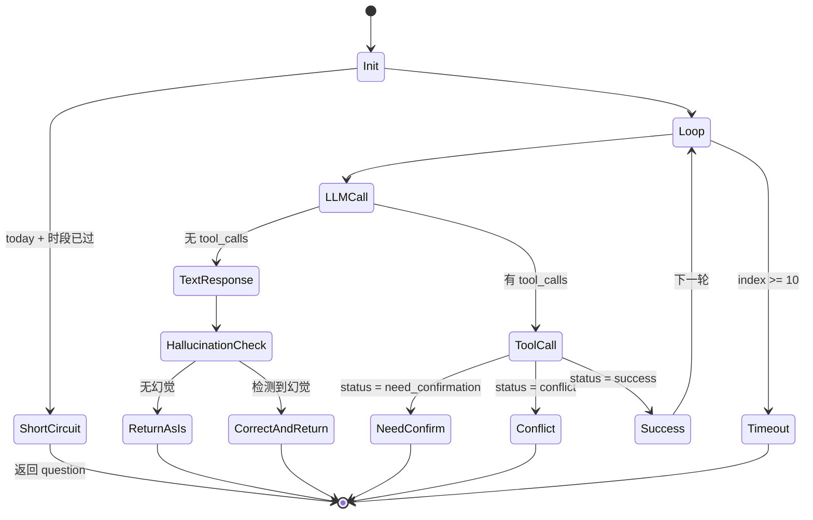

# 02 · 落到你的 chat 模块上（Q2b）

> 回答你笔记里的 Q2b：针对这个 Home Task 应用，具体如何管理复杂度？
>
> 本文是 `01-what-is-complexity.md` 的落地版，读之前建议先看 01。

## 0. 先说结论

你对 chat 模块"超出掌控"的感觉是真实的 —— 我读了 `packages/server/src/services/ai/` 的代码，**它确实不小**：9 个文件、~1553 行，`agent-loop.ts` 单文件 301 行。但这不是"写烂了"，而是因为这个模块同时在扛几种不同性质的复杂度。搞清楚哪些是必须扛的、哪些是可以减的，是管理它的第一步。

我的总结会用一个比"本质 vs 偶然"更有用的 **三层分类**（感谢一次 GPT 交叉审核收紧了这里）：

- **领域复杂度**（不可消除，只能建模和隔离）：时间语义、语义冲突、多轮对话里的状态转换、跨群组鉴权。这些是任务管理这件事本身就带的。
- **架构选择复杂度**（源自你当前技术路线，原则上可以换方案绕掉）：LLM 幻觉、手动 tool-call loop、prompt 和代码里并存的两套规则、单 agent 和多 agent 并存。这些复杂度不是"任务管理天然要承担的"，而是"选择用 LLM 驱动 + tool loop + prompt 工程"之后才出现的。
- **实现偶然复杂度**（写法导致，最容易收敛）：退出路径散落、跨轮状态用栈变量传递、`HallucinationGuard` 是浅模块。

区分前两类尤其重要：**领域复杂度要接受、建模、隔离；架构选择复杂度要先问"能不能删掉、缩小、替换"，再问"怎么建模"**。

**最值得你按顺序做的四件事**（顺序本身比清单内容更重要）：

1. **先写 ADR-0001：钉住主线** —— 单 agent 是遗留、长期并存、还是准备迁走？这件事不定，下面三件事的优先级都会漂。
2. **把时间规则做成 table-driven tests** —— 这是最容易漂移的一组规则，也最适合作为 AI 修改代码时的边界锚点。这一步相当于给最关键的一小块领域做"规格即测试"。
3. **给 `AgentLoop` 画一张状态图** —— 盘点所有退出路径。画不出来的时候，就是该重构的时候。
4. **最后再考虑要不要做大规模 Rule Book / `docs/` 重组** —— 不是优先级最高的那件事。主线和测试锚点没钉住之前，Rule Book 很容易变成另一份会过期的说明书。

- **你不需要做的事**：给每个函数画流程图、搬 Event Sourcing、自建文档同步工具。

下面展开。

---

## 1. 我读到的代码结构（速览）

```
packages/server/src/services/ai/
├── index.ts              51  组合根 (AIService)
├── types.ts              42  共享类型
├── agent-loop.ts        301  ★ 主循环 + 短路 + 幻觉兜底 + 跨轮状态
├── prompt-builder.ts    322  System prompt + 所有时间工具函数
├── tool-executor.ts     338  5 个 tool 的执行路径 + 校验 + DB 写
├── tool-definitions.ts  171  5 个 tool 的 OpenAI JSON schema
├── hallucination-guard.ts 163 关键词意图识别 + 幻觉检测
├── conflict-detector.ts  98  Dice 系数语义冲突 + 时间冲突
└── history-manager.ts    67  messages 表读写
                        ----
                       1553
```

你的 `Single-Agent设计文档.md` 里 C4 L3 图已经把它们的依赖关系画出来了，而且准确。这本身是个好兆头：**你能画出它，说明它还没失控，只是已经到了"必须靠图才能握住"的阶段。**

> **更新（2026-04-11）**：后续 `aa1773e` 已把 single-agent chat 的工具能力从 5 个收敛到 3 个（`create_task` / `query_tasks` / `complete_task`），移除了聊天内 `update_task` / `delete_task` 执行路径；当前 `packages/server/src/services/ai/` 仍是 9 个文件，但总行数已降到约 1423 行。

---

## 2. 复杂度分类：三层，不是两层

原来这一节按 Brooks 的"本质 / 偶然"二分来分类。一次 GPT 交叉审核指出一个我漏掉的点：把"架构选择带来的复杂度"混在"本质复杂度"里会让你不自觉地接受它们。所以这里改用三层分类：

- **领域复杂度** → 接受、建模、隔离
- **架构选择复杂度** → 先问"能不能删掉、缩小、绕开、降级"，再问"怎么建模"
- **实现偶然复杂度** → 直接重构

这三层是一个 **谱系**，不是硬边界。同一条复杂度常常横跨两层（§2.4 有例子）。分类时我按"最主要的性质"放，但会在条目里注明灰色地带。

### 2.1 领域复杂度（不可消除，只能建模）

这些复杂度是"任务管理这件事本身就带的"。无论你用什么架构、什么语言，甚至不用 LLM，它们都会出现。

| 来源 | 为什么必然存在 |
| --- | --- |
| **时间语义** | 用户说"明天下午"、"晚上"、"凌晨 3 点到 5 点"，系统必须能识别；"今天已经 19:00 了不能再安排下午"这类规则是业务要求 |
| **语义冲突** | "买菜" vs "采购食材"是同一件事，必须识别；这需要某种模糊匹配算法 |
| **多轮对话里的状态转换** | "创建任务 → 等用户确认冲突 → 接受"这种对话状态必须在多轮之间保持一致 |
| **跨群组鉴权** | 一个用户在多个群组里有不同角色，每个读写操作都要回到"这个人在这个群组有没有权限" |

这些你逃不掉。能做的只有：**把每一条限制在一个尽量深的模块里，别让它渗出来污染其他地方。** Ousterhout 意义上的"深模块"。

#### 展开：语义冲突怎么实现？（三档方案对比）

你当前的做法是 Dice 系数（`conflict-detector.ts` 里的 `findSemanticConflicts`）。Dice / Jaccard / 编辑距离这类"字面相似度"算法便宜、快、完全确定，但只能抓字面重合，抓不到"买菜 vs 采购食材"这种 **近义表达**。要想抓得更聪明，中间还有一档更好的选项，不是非得直接跳到 LLM：

| 方案 | 成本 | 延迟 | 效果 | 确定性 |
|---|---|---|---|---|
| Dice / Jaccard / 编辑距离（你现在的） | 0 | < 1ms | 只认字面相似 | 完全确定 |
| **Sentence embeddings + 余弦相似度** | ~$0.00002/次 | ~100ms | **抓语义，"买菜" vs "采购食材" 能 match** | 基本确定 |
| 独立 LLM 判断 | ~$0.001/次 | 300–1000ms | 最聪明，能解释理由 | 有随机性 |
| 自训练分类模型 | 前期训练贵 | 推理快 | 需要大量标注数据才有意义 | 确定 |

**生产里最常见的是中间一档**：用像 OpenAI 的 `text-embedding-3-small` 或国内的 `bge-small` 这样的小模型，把每个候选任务的标题转成向量，比对新任务向量和已有任务向量的余弦相似度。便宜（一次调用大约千分之二分钱）、快（100ms 级）、抓语义。枚举方案走不通（用户表达方式无限），机器学习只有在"你已经有大量标注数据"时才有意义，对小项目是 overkill。

**升级路径**：当前 Dice → 加 embedding 作为第二层判断 → 某些高风险 case 再用 LLM 兜底。一步一步来，不用一次迁到 LLM。

> 这个展开也正好说明了一件事：**领域复杂度（必须识别"同一件事"）不能消除，但不同的实现手段会显著影响"你为这份复杂度付出多少代价"**。选对了实现手段，领域复杂度的负担可以从"必须维护一堆字面规则"变成"交给一个小模型 + 100ms 延迟"。

### 2.2 架构选择复杂度（原则上可以替换，但当前路线引入了它们）

这些复杂度你 **原则上可以不碰**。一旦选了"用 LLM + 手动 tool-call loop + prompt 工程 + 多 agent 编排"这条路，它们就会自动出现。对这一层，判断是否保留它们比如何建模它们更重要。

| 来源 | 本来可不可以绕掉？ | 绕掉的代价 |
| --- | --- | --- |
| **LLM 幻觉** | 只要用 LLM 做任务执行就无法完全绕掉；但可以通过 structured output、JSON mode、强制工具调用等把表面积收小 | 少一点自然语言灵活性，多一点工程约束 |
| **手动 tool-call loop** | 可以换 LangChain AgentExecutor 或 LangGraph 内置执行器 | 少一点可观测性和控制力，多一层抽象依赖 |
| **prompt 和代码里的双轨规则** | 可以规定"规则只写在代码里，prompt 只读代码导出的规则文本"（你的 `agent-design-principle.md` 已经写了这一条） | 少一点"让 LLM 自由发挥"的空间 |
| **单 agent 和多 agent 并存** | 完全可以"先只做一条"或"新架构完成后退役旧架构" | 少一点演进灵活性，多一点决断痛感 |

**这一层是最需要警觉的地方**：如果把它们统一叫"本质复杂度"，你会下意识地接受它们，然后继续在它们之上加工程投入。但其中每一条，理论上都有"删掉 / 缩小 / 替换"的空间。对这一层的首要问题不是"怎么让它更可维护"，而是"**这一条我还要不要留？**"

> **更新（2026-04-11）**：`f199d71` 已通过 `docs/adr/0001-agent-deployment-mainline.md` 把这条主线钉住：单 agent 是 Cloudflare 部署主线，多 agent 是 Node / 本地增强路径。因此这里提到的“并存但没说哪条是主线”问题已经修复；现在剩下的是两条路径各自的边界治理，而不是“到底保留哪条”。

**"LLM 幻觉"是个好例子**：你当前用 `HallucinationGuard` 的关键词匹配来事后检测。这当然有用，但更根本的做法可以是"让 LLM 通过 structured output 给出一个带 `action_taken` 字段的 JSON，`action_taken == 'created'` 的路径只能由 tool 走" —— 这是用 **架构** 把可幻觉的表面积压小，而不是用 **guard** 去事后纠正。你可以选择不这样改，但至少在决定保留它之前要知道这个选择的含义。

**"规则散落"是另一个例子**。同一条规则（例如"今天已过下午，不能再创建下午的任务"）目前同时出现在：

1. `prompt-builder.ts` 的 `buildSystemPrompt()`（告诉 LLM）
2. `agent-loop.ts` 开头的短路检测（硬编码绕过 LLM）
3. `tool-executor.ts` 的 `create_task` 分支（兜底）
4. `原始PRD.md`
5. `Single-Agent设计文档.md` 第 5 节和第 7 节

**每次规则要改，你要同步 5 个地方** —— 典型的 change amplification。根本原因是你在 **prompt 和代码里双轨表达同一条规则**。治本的做法是：规则只用代码里的一份常量表达，prompt 从代码生成 —— 这样 LLM 被引导的"规则"和代码执行的"规则"物理上就是同一份。这属于架构选择复杂度，因为它完全可以通过"规则只能写在代码里"这条纪律绕掉。具体怎么做放到 §3 的优先级 4 里讲。

### 2.3 实现偶然复杂度（写法导致，可以直接收敛）

以下几条是我读代码时觉得"如果不是现在这样会更简单"的地方。**我的判断可能不准 —— 有些是你已经做过权衡的选择 —— 所以读的时候把它们当成"可以聊一聊的候选项"。**

**实现偶然 A：退出路径散落**

`AgentLoop.chat()` 里至少有 5 种退出路径：

1. 短路（今天 + 时段已过）→ 在进入 LLM 循环之前就 return
2. LLM 文字回复，无幻觉 → 正常 return
3. LLM 文字回复，检测到幻觉 → 改写 content 后 return
4. Tool 返回 `need_confirmation` 或 `conflict` → 提前 return
5. 10 轮循环耗尽 → timeout fallback

每个路径都要自己调 `saveMessage(user)` + `saveMessage(assistant)` + 构造 `AIServiceResult`。这意味着 **"保存用户消息和助手消息"这件事在一个函数里被写了 5 遍**。这是典型的 "change amplification" —— 哪天你要加一个字段，5 个地方都要改。

> 偶然性：中。你可以通过一个"退出包装器"把这个消除 —— 所有退出路径都先 push 到一个 `pendingReturn` 变量，循环结束后统一处理。但这会让控制流更间接。需要权衡。

> **更新（2026-04-11）**：`f199d71` 已引入 `finishChat()` 和 `buildPayloadFromToolResult()`，把多条退出路径中重复的 `saveMessage + 返回值组装` 收敛到了统一收尾逻辑；`aa1773e` 又把更新/删除意图提前短路成“去任务列表操作”的文本返回，进一步减少了高风险分支。所以这条问题已经 **部分修复**，但 `AgentLoop.chat()` 仍然保留多路径 return 的形态。

**实现偶然 B：跨轮状态用栈变量传递**

`lastSignificantResult` 这个变量是 `chat()` 方法的栈变量，被用来记住"上一次有意义的 tool 结果"，等 LLM 最终给文字回复时从里面取出 task 或 conflicts 附加到返回值里。这个机制正确，但**它是一个隐藏的、没有名字的状态机**。新来的人看代码不容易发现它。

> 偶然性：中低。可以考虑把它显式成一个 `LoopContext` 对象，所有跨轮的状态都放进去，这样"跨轮的"和"本轮的"状态一眼就能分开。但对一个 300 行的方法，收益可能不够大。

**实现偶然 C：HallucinationGuard 是浅模块**

`HallucinationGuard` 暴露了至少 6 个独立的小方法：

- `inferTaskIntent`
- `shouldRequireToolCall`
- `shouldSkipSemanticConflictCheck`
- `looksLikeActionSuccess`
- `buildActionNotExecutedMessage`
- `hasDateHint` (间接通过 promptBuilder)

调用方（`AgentLoop`）必须知道在什么时机调哪一个、以及它们之间的组合逻辑。这是 Ousterhout 定义的 "浅模块"。

**更深的接口可能长这样**：

```ts
// 当前写法：调用方要记住 6 个方法的调用顺序和组合逻辑
// ↓
// 改后：调用方只需要一个"分类器"，它返回一个策略决定
const policy = guard.classifyLLMResponse({
  userMessage,
  llmContent,
  hasToolCall,
  lastSignificantResult,
  intent,
});
// policy: { action: "return_as_is" | "correct_hallucination" | "require_tool" | ..., newContent?: string }
```

**所有的"在什么时机判断什么"都被封到 guard 内部。** AgentLoop 只管按策略执行。

> 偶然性：高。这个重构我比较推荐做。收益是 AgentLoop 会瘦一大圈，而且"幻觉相关逻辑"的修改都集中在一个地方。

> **更新（2026-04-11）**：`f199d71` 已把 `HallucinationGuard` 的对外接口收敛为 `evaluateUserMessage()` 和 `resolveNoToolCallResponse()`，并将 `shouldRequireToolCall()`、`shouldSkipSemanticConflictCheck()`、`looksLikeActionSuccess()`、`buildActionNotExecutedMessage()` 等细节收回内部辅助逻辑。因此这里说的“浅模块”问题已经 **部分修复**。

### 2.4 提醒：这是谱系，不是硬边界

上面三层之间经常混着同一件事的不同性质。几个灰色地带：

- **"今天已过下午不能创建下午任务"** 作为 *规则本身* 是领域复杂度；但 *把它同时写在 prompt + 短路 + 兜底三处* 是架构选择复杂度；而 *同步这三处时散落的注释和重复字符串* 是实现偶然复杂度。
- **"多轮工具调用"**：*"需要多次调用才能完成一件事"* 是领域复杂度；但 *手动写 10 轮循环 + 栈变量追踪* 是架构选择复杂度；*每条退出路径重复 `saveMessage`* 又是实现偶然复杂度。

遇到同一件事横跨几层时，不要强行归一类，而要按层分别回答："哪一层是可以减的？"这个问题比"它属于哪一类"更重要。

---

## 3. 最值得做的四件事（按优先级）

> 一次 GPT 交叉审核里有一个重要提醒：当前仓库的真正痛点 **不是"规则散"**，而是 **"单 agent / 多 agent 主线还没钉住"**。先钉主线，再做重构和测试锚点，最后才考虑大规模的 Rule Book / 文档重组。原文最初的顺序是 "Rule Book → 状态图 → ADR"，新的顺序把这件事翻过来了 —— 顺序比清单本身更重要。

### 优先级 1 — 写 ADR-0001：钉住单/多 agent 的主线

为什么这是第 1 优先级？因为你当前仓库的 **真正痛点** 不是"规则散"，也不是"退出路径乱"，而是 **"单 agent 还要不要继续演进、和多 agent 是什么关系"这件事没钉住**。证据：

- 有 `docs/Single-Agent设计文档.md`，也有 `docs/multi-agent-design.md`
- 单 agent 的老测试已经跳过，多 agent 的测试已经存在
- `packages/server/src/services/ai/` 仍然是整套代码主体，但 `packages/server/src/services/multi-agent/` 正在长
- prompt-builder 的契约测试已经有雏形

这种"两条路并存但没说哪条是主线"的状态，是后面所有重构决定漂移的根源。不先钉住它，你投资给"改 AgentLoop"的时间有可能过两周白费；反过来，你投资给多 agent 的时间有可能被"其实单 agent 还是长期主线"打脸。

建议立刻写 `docs/adr/0001-agent-main-line.md`，内容不需要长，3 个标题就够：

- **Context**：目前 `services/ai` 的单 agent 实现和 `services/multi-agent` 的多 agent 实现同时存在，但没有明确的主线声明。说明现状和犹豫点。
- **Decision**：从今天起，主线是 {单 agent / 多 agent / 并存到某个里程碑}。配套纪律是 ...
- **Consequences**：接下来 {哪些重构会做 / 不会做}；{哪些测试会被正式接受为规格 / 哪些会被退役}。

写这份 ADR 的过程本身就会逼你把隐性的犹豫显性化 —— 这也是 ADR 的核心价值。**只有钉住这一点，下面三件事的优先级才稳得住。**

> **更新（2026-04-11）**：这一项已经在 `f199d71` 落地，对应文件是 `docs/adr/0001-agent-deployment-mainline.md`。它明确了单 agent 并非待退役遗留，而是 Cloudflare 部署主线；多 agent 则保留为 Node / 本地增强路径。

### 优先级 2 — 把时间规则做成 table-driven tests

GPT 交叉审核里也提了这一条，我认同。理由：

- 时间规则是最容易漂移的领域规则（你现在已经有 5 个地方在提它）
- 它的输入输出非常适合用 table 表达
- 作为 AI 修改代码时的"护栏"，它比 prose 文档更硬

具体做法：在 `packages/server/src/services/ai/__tests__/time-rules.test.ts` 或类似位置写：

```ts
// 这张表 = 这条规则的可执行规格
describe("时间段规则", () => {
  const cases = [
    // [当前时间, 用户意图, 期望行为]
    ["2026-04-11 08:00", "今天下午 3 点", "allowed"],
    ["2026-04-11 19:00", "今天下午 3 点", "reject:time_passed"],
    ["2026-04-11 19:00", "今天晚上",      "allowed"],
    ["2026-04-11 08:00", "全天",          "allowed"],
    ["2026-04-11 21:00", "全天",          "reject:all_day_after_evening"],
    // ...
  ] as const;

  test.each(cases)("now=%s, intent=%s → %s", (now, intent, expected) => {
    expect(evaluateTimeRule({ now, intent })).toBe(expected);
  });
});
```

这张 table 就是规则的 **规格**。之后无论你改 `prompt-builder.ts` 还是 `tool-executor.ts` 里的时间处理代码，都要先问"它还满足这张表吗"。这张表就是你给 AI 修改代码时的边界锚点。

**和优先级 4（Rule Book）的关系**：这张 table 可以被视作 Rule Book 的"可执行版本"。等你将来决定要做 Rule Book 时，只需要把 table 里的 case 抽出来作为常量，prompt-builder 从同一份常量派生 —— 这时你已经有现成的 test fixtures 可用。所以先做 table-driven tests 是一个"起步不贵但兼容未来"的选择。

> **更新（2026-04-11）**：这一项已经在 `8e3978e` 落地，对应文件是 `packages/server/src/__tests__/ai/single-agent/unit/ai.prompt-builder.time-rules.test.ts`。像“今天已过时段”“晚上不能选全天”这类规则已经有了可执行锚点；不过规则仍未收敛成单一事实源，所以它修的是“测试锚点”，不是“规则散落”本身。

### 优先级 3 — 给 AgentLoop 画一张状态图，盘点退出路径

你的 Sequence Diagram 很好（`Single-Agent设计文档.md` §4.2），但 Sequence Diagram 适合描述"一次调用怎么流动"，不适合回答"我有多少种退出路径？各自条件是什么？会不会漏一个？"

**State Diagram（或 Decision Table）** 对后者更擅长。长这样：



画一次，放在 `docs/Single-Agent设计文档.md` 里紧跟 Sequence Diagram 后面。以后每次你要加一条退出路径，先在图上画，再动代码。**当图不容易画的时候，就是你该重构的信号。**

> 为什么放在第 3 而不是更前？因为如果优先级 1 的 ADR 判定"单 agent 准备退役"，给它画状态图的投入就打折了 —— 更该画的是多 agent 的 Supervisor 状态图。这正是为什么主线决定要先做。

> **更新（2026-04-11）**：这一项也已经落地。当前 `docs/Single-Agent设计文档.md` 已新增 `4.3 State Diagram — chat() 状态与退出路径`，把 unsupported intent、时间短路、tool loop、timeout 等退出路径画了出来。

### 优先级 4（暂缓）— 大规模 Rule Book / `docs/` 重组

**为什么放到最后？** 那次 GPT 交叉审核指出一个我原文没说清楚的点：**你当前仓库不是"没有文档"，而是"文档已经不少，而且架构正在迁移"**。在主线没钉住之前做大规模的 Rule Book / 文档重组，很容易产生"形式上更整齐，但维护成本没下降"的整理。

等到 ADR-0001 钉住主线、测试锚点建起来之后，如果你仍然觉得"规则分散"是大痛点，再考虑把时间规则从 table-driven tests 升级成一个共享的 TypeScript 常量模块，让 prompt-builder、tool-executor、tests 都从它派生。例如：

```ts
// packages/server/src/services/ai/rules/time-segment-rules.ts
export const TIME_SEGMENT_RULES = {
  segments: {
    all_day: { start: "00:00", end: "23:59", labels: ["全天"] },
    early_morning: { start: "00:00", end: "05:59", labels: ["凌晨"] },
    morning: { start: "06:00", end: "08:59", labels: ["早上"] },
    // ...
  },
  today: {
    // 今天已过的时段不允许被选中
    disallowPastSegments: true,
    // 当前已到晚上，不允许 all_day
    disallowAllDayAfterEvening: true,
  },
  // ...
} as const;
```

然后：

- `prompt-builder.ts` 从这份常量 **生成** system prompt 里的规则部分
- `tool-executor.ts` 从这份常量 **生成** 时段校验逻辑
- 文档里通过一个小脚本 **生成** Markdown 表格（docs-as-code）
- 单元测试里直接读这份常量做断言

**规则只写一次。Prompt、代码、文档、测试都派生自它。** 这是 "living documentation" 的本质。

> 这不是放弃这个想法，而是 **把它从"第一件事"改到"主线钉住之后的第一件事"**。原则没变，顺序变了。

### 关于 ADR 的简短说明

你可能会问"ADR 是什么、怎么写？"。Michael Nygard 2011 年的原文里定义很简单：每条 ADR 是一个 Markdown 文件，3 个标题就够 —— **Context**（背景）/ **Decision**（决定）/ **Consequences**（后果，包括"我们放弃了什么"）。

**关键纪律**：ADR 是 **append-only**。决定错了，不要改旧 ADR，而是写一条新的 ADR 覆盖它（Supersedes: ADR-XXXX）。这样你半年后能看到完整的决策演进史。

除了优先级 1 里的 ADR-0001，后面可以追加写的（顺序不强求）：

- **ADR-0002**：为什么用手动 tool-call loop，而不用 LangChain AgentExecutor？
- **ADR-0003**：为什么时间采用"具体时段 ⊕ 模糊时段"互斥而不是统一用时间范围？
- **ADR-0004**：为什么幻觉检测用关键词匹配，而不用 structured output 或 retry？
- **ADR-0005**：为什么规则要放在 Tool 代码里而不是 prompt 里？（这条你 `agent-design-principle.md` 里已经讲过，可以直接 promote 成 ADR）

每条 3–10 行即可。写的行为本身会逼你把隐性知识显性化。

---

## 4. 你 _不_ 需要做的事

- **不要给每个函数画流程图。** 图的维护成本非常高。只给"多条路径纠缠"的地方画图，例如 `AgentLoop`。
- **不要搬 Event Sourcing / CQRS / 微服务。** 这些在你当前规模不是解决方案，是新问题。
- **不要自建"PRD 和代码自动同步"的工具。** 已有的开源方案（living docs、Docusaurus、C4-PlantUML 等）足够了。先把"同一事实只写一次"这件事做对，同步问题就消了一大半。
- **不要把 `services/ai/` 拆成更多的子目录。** 现在 9 个文件是合理的。拆得太细反而会让 agent-loop 的耦合更隐蔽。
- **不要追求 100% 的幻觉检测覆盖。** 幻觉是本质复杂度，你的当前策略（关键词 + 改写 content）对小项目够用了。继续投资的边际收益很低。除非你观察到实际业务问题，否则不要动。

---

## 5. 我不确定的地方（需要你补充）

为了给出更针对性的建议，我需要先知道：

1. **你当前最痛的是哪一部分？** 是"改一个时间规则要动 5 个地方"？还是"给 AgentLoop 加一个新 tool 怕改炸"？还是"新来一个 agent 不知道往 supervisor 里怎么接"？**不同的痛点对应不同的优先级。**
2. **你打算让单 agent 和多 agent 长期并存，还是最终迁移到多 agent？** 如果是后者，很多投入在单 agent 的重构就别做了。
3. **你改 chat 模块的频率如何？** 每周都在动 vs 每月才动一次，决定了你值不值得为它建 Rule Book + 生成器。
4. **你有没有跑自动化测试的习惯？** 有没有 `pnpm test` 的生态？如果测试基础设施已经在，优先级 1（Rule Book）就能顺势配出好的测试；如果没有，单独搞 Rule Book 的价值会打折。

回到对话里告诉我这几点，我可以把"该做的清单"再收窄一轮。

---

## 6. 下一步

读完这篇建议你再看：

- `03-docs-as-engineering.md`：你关于"代码像肉体，文档像精神"的比喻 + PRD 与模块文档一致性问题。
- `04-ai-era-and-specs.md`：AI 编码时代程序员的价值重心转移，以及它怎么绕回到复杂度管理。
