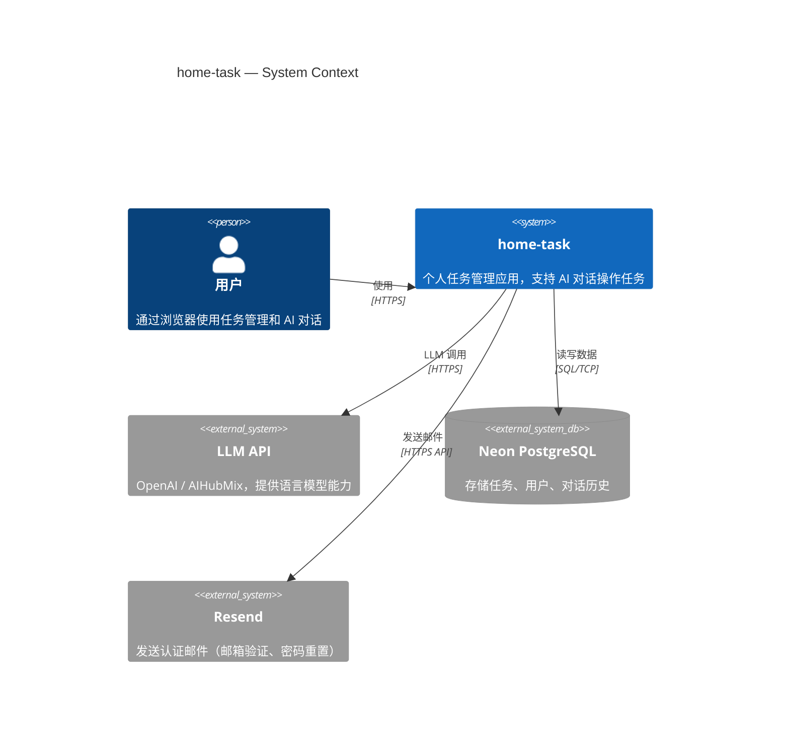
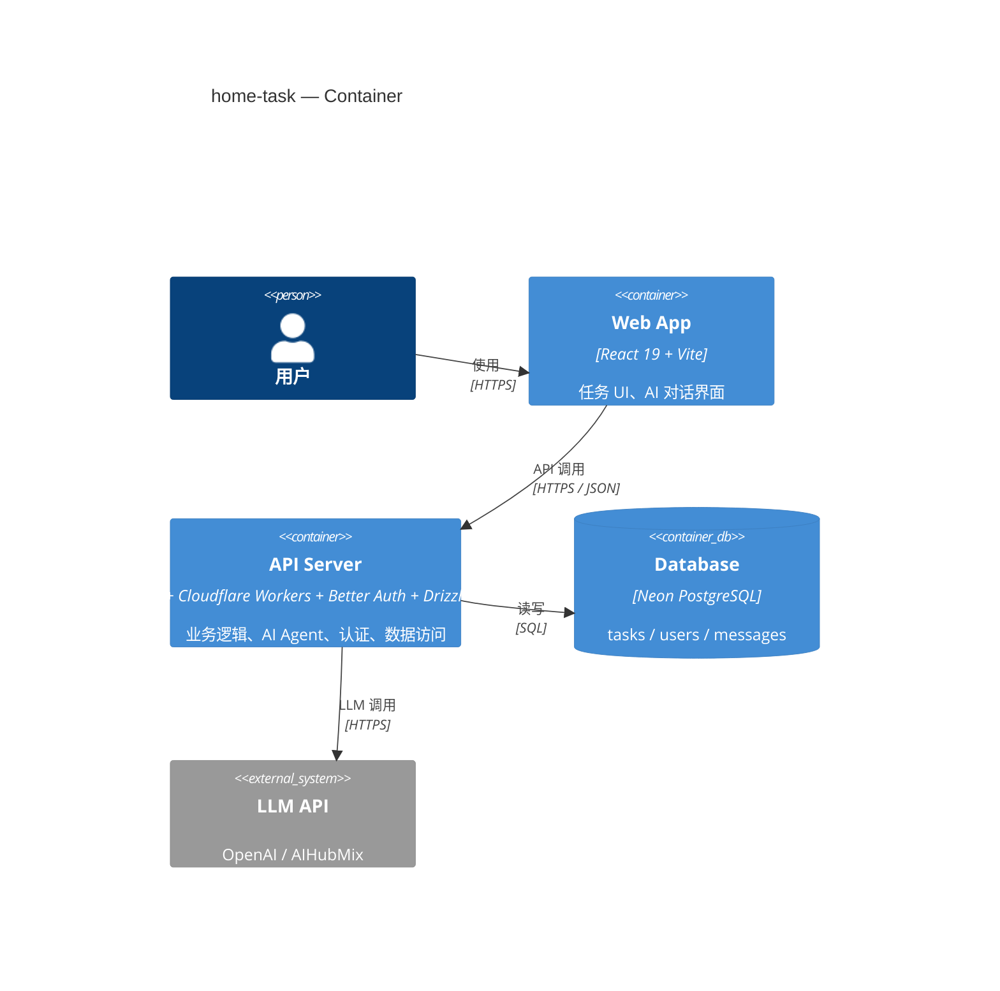
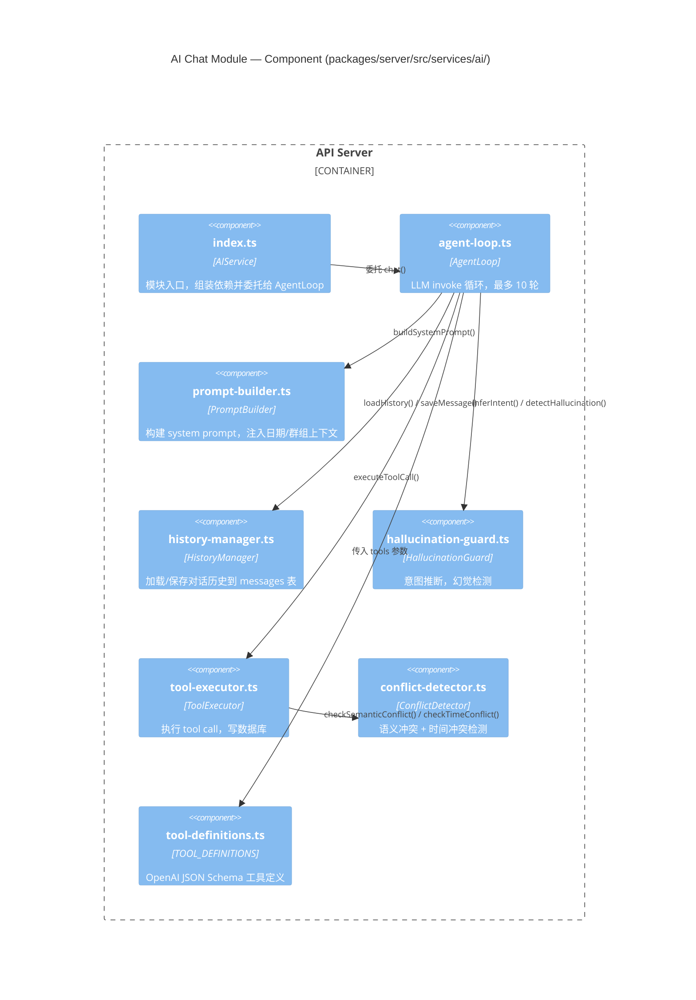

# C4 Model（C4 架构图）

## 是什么 / 解决什么问题

C4 Model（Simon Brown）用**四个层级**描述软件架构，每层对应不同的受众和问题：

| 层级 | 问题 | 受众 |
|------|------|------|
| L1 Context | 系统和外部世界什么关系？ | 所有人 |
| L2 Container | 系统内部有哪些可部署单元？ | 开发者、架构师 |
| L3 Component | 一个 Container 内部由哪些模块组成？ | 负责该模块的开发者 |
| L4 Code | 类/函数级 | 通常不画 |

**适合的场景：**
- 向新人解释"这个系统整体长什么样"
- 模块拆分后想看清"谁依赖谁"
- 做技术方案评审时需要结构化沟通

**解决的问题：**
- 一张图塞了所有细节 → 用层级解决信息密度问题
- 新人不知道从哪里入手 → L1/L2 给方向，L3 给落脚点
- 模块边界模糊 → Component 图强迫你画清楚职责

---

## 示例 L1：系统上下文

> 整个 home-task 应用与外部的关系

> **注意**：Better Auth 是 npm 库，直接集成在 API Server 内部，不是外部系统，所以不出现在 L1。L1 里只放真正独立部署的外部服务——本项目中就是 LLM API、Neon 数据库、Resend 邮件服务。

---

## 示例 L2：容器视图

> 应用内部有哪些可部署/可运行单元

---

## 示例 L3：AI Chat 模块组件视图

> `packages/server/src/services/ai/` 内部结构

---

## 使用建议

- **L1 + L2** 写一次，基本不用改，放在项目根 README 或 `docs/` 里
- **L3** 是最有价值的——模块重构后记得更新
- Mermaid 适合把架构图以文本形式放进仓库；但 C4 语法在 Mermaid 中仍属 experimental，需注意平台和版本兼容性。如果目标平台不支持 Mermaid C4，可以用 PlantUML、Structurizr，或导出静态图片
- 每张图控制在 6-8 个节点以内，超了就拆成两张
