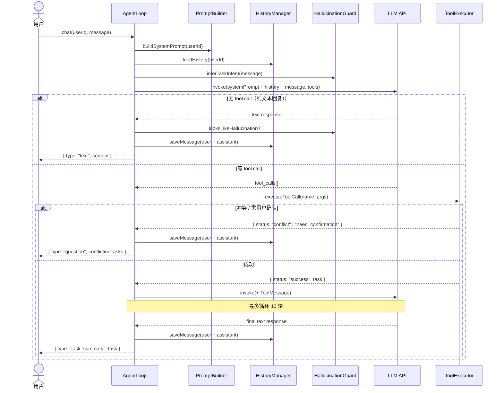
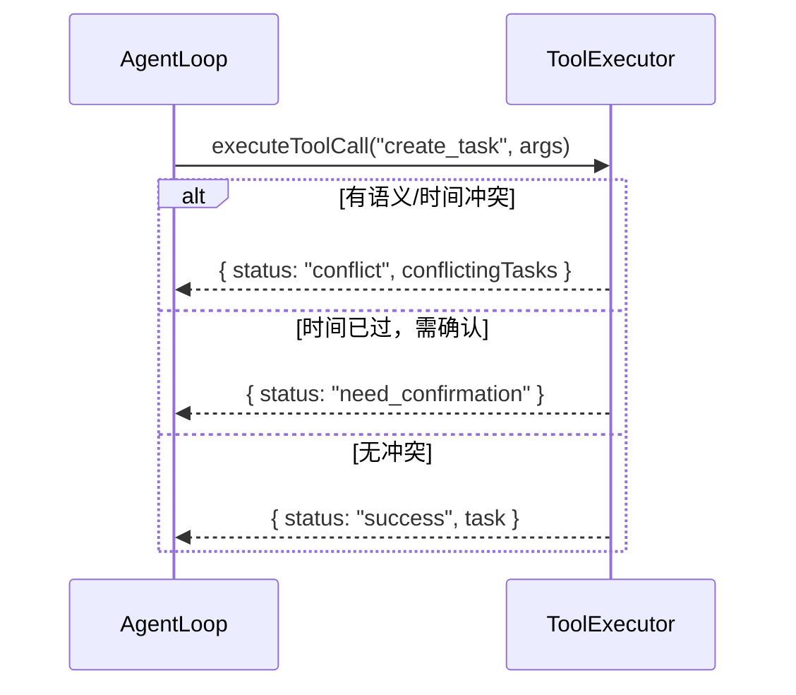
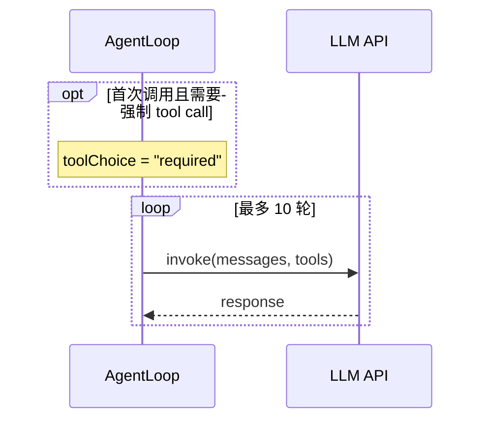

# Sequence Diagram（时序图）

## 是什么 / 解决什么问题

时序图描述**一个流程在时间轴上如何展开**：谁在什么时候调用谁、收到什么、如何分支。

**适合的场景：**
- 有多个模块交互的异步/循环流程（最典型：AI agent loop）
- 需要让新人快速理解"一条请求从进来到出去经历了什么"
- 有条件分支（冲突/成功/追问）需要可视化

**解决的问题：**
- 光看代码很难感知"调用顺序"和"分支出口"
- 文字描述容易漏掉异常路径
- 新人读模块时没有全局时间线

---

## 示例：AI Chat 模块的 Agent Loop

> 覆盖路径：用户消息进来 → 预处理 → LLM invoke → tool call → 最终回复

---

## 常用语法快查

Mermaid 时序图的语法量很小，但有几个关键字容易混淆：

| 关键字 | 含义 | 类比 |
|--------|------|------|
| `alt / else / end` | 条件分支（if / else if / end） | switch-case |
| `opt` | 可选操作（只有 if，没有 else） | if without else |
| `loop` | 循环（标注终止条件） | for / while |
| `par` | 并行执行 | Promise.all |

**`alt` 示例**（本项目用得最多，因为 create_task 有大量分支）：

`opt` 和 `loop` 示例：

---

## 使用建议

- 这张图放在模块 README 或设计文档最前面，是"进入代码前的地图"
- 用 Mermaid 写，直接住在 `.md` 文件里，和代码一起做版本控制
- 只画主干路径 + 关键分支，不要试图覆盖所有边界情况（那是单测的工作）
