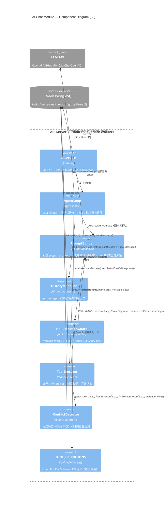
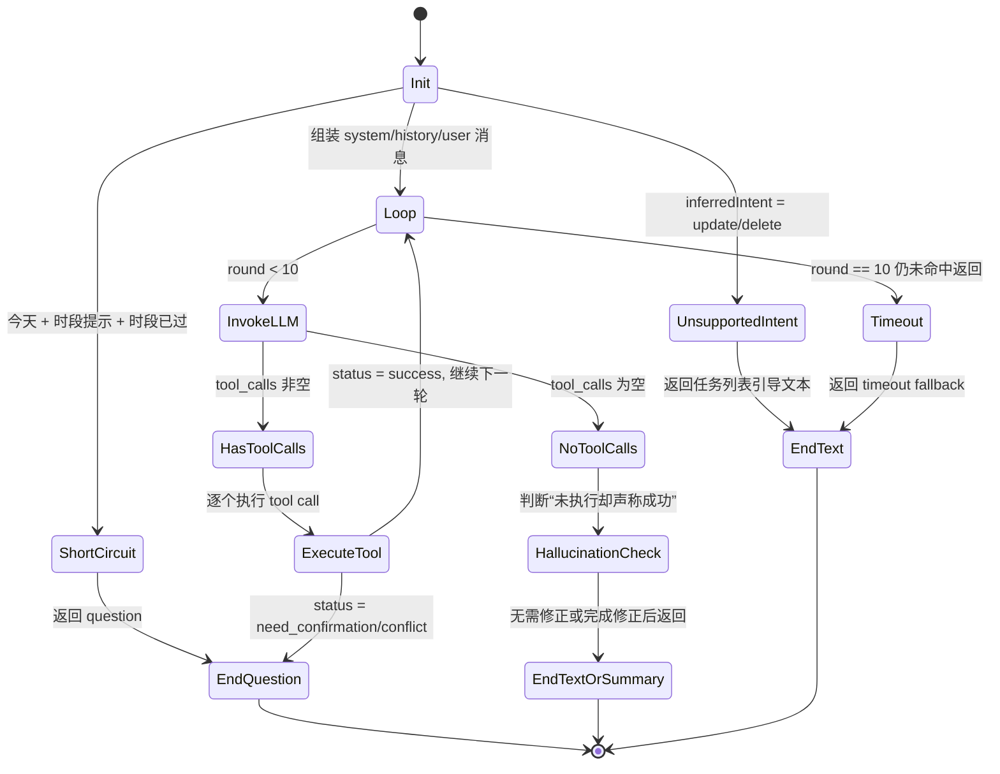

# AI Agent 设计文档

## 1. 概述

AI Agent 用于通过自然语言完成任务管理（创建、查询、完成）。系统运行在 Cloudflare Workers（Serverless），每次请求独立，上下文由数据库 `messages` 表串联。
其中“修改/删除”不在 AI Chat 内执行，统一引导到任务列表操作。

核心原则：

- 快乐路径极简：指令清晰且无冲突时直接执行，不额外确认。
- 需要时才追问：信息不完整或存在冲突时才追问。
- 分层可替换：模型与工具可替换，History 与路由保持稳定。

---

## 2. 关键取舍

1. 保留 LangChain 模型适配，不使用 AgentExecutor  
   仅使用 `@langchain/openai` 的 `ChatOpenAI` 与 `@langchain/core` 的消息类型，不引入 `langchain` 主包。

2. 使用 OpenAI 原生 tool schema  
   工具以 OpenAI JSON Schema 定义，手动管理 tool-call 循环。

---

## 3. 架构分层

```
Layer 1: Model
  - ChatOpenAI（OpenAI 或 AIHubMix 中转）

Layer 2: Tools
  - OpenAI JSON Schema 工具（create_task / query_tasks / complete_task）

Layer 3: Agent 调度
  - 手动 loop：invoke -> 执行 tool -> ToolMessage 回传 -> 再 invoke
  - 最大 10 轮

Layer 4: History
  - 直接读写 messages 表（system 消息不落库）
```

---

## 4. 架构图

### 4.1 C4 Level 3 — 组件结构图

> 展示 `packages/server/src/services/ai/` 内部 8 个文件的职责与依赖关系。



---

### 4.2 Sequence Diagram — chat() 完整调用时序

> 覆盖所有分支：短路返回 / 幻觉拦截 / 三个 tool 的执行路径 / 更新删除引导 / 冲突/确认早退 / 超时兜底。

```mermaid
sequenceDiagram
    actor U as 用户
    participant AL as AgentLoop
    participant PB as PromptBuilder
    participant HM as HistoryManager
    participant HG as HallucinationGuard
    participant LLM as LLM API
    participant TE as ToolExecutor
    participant CD as ConflictDetector
    participant DB as Neon PostgreSQL

    U->>AL: chat(userId, message)

    note over AL,DB: ── 初始化阶段 ──

    AL->>PB: buildSystemPrompt(userId)
    PB->>DB: SELECT groupUsers+groups WHERE userId AND status=active
    DB-->>PB: userGroups[]
    PB-->>AL: systemPrompt（含今日/星期/时段/群组列表）

    AL->>HM: loadHistory(userId, limit=20)
    HM->>DB: SELECT messages ORDER BY createdAt DESC LIMIT 20
    DB-->>HM: rows[]（过滤 system 角色后反转为正序）
    HM-->>AL: BaseMessage[]

    AL->>HM: loadLastAssistantMessage(userId)
    HM->>DB: SELECT messages WHERE role=assistant ORDER BY createdAt DESC LIMIT 1
    DB-->>HM: row | null
    HM-->>AL: LastAssistantMessage | null

    AL->>HG: evaluateUserMessage(message, lastMsg.content)
    note right of HG: 输出 inferredIntent / requireToolCall / skipSemanticCheck
    HG-->>AL: userPolicy

    alt inferredIntent = update 或 delete
        AL->>HM: saveMessage(user, message)
        AL->>HM: saveMessage(assistant, "请到任务列表中修改/删除任务", text)
        AL-->>U: { type:"text", content }
    end

    note over AL,DB: ── 短路检测（绕过 LLM）──

    alt message 含"今天" && hasTimeSegmentHint(message)
        AL->>PB: inferTimeSegmentFromText(message) → hintedSegment
        AL->>PB: isSegmentAllowedForToday(today, hintedSegment)
        PB-->>AL: false（当前时段已过目标时段）
        AL->>HM: saveMessage(user, message)
        AL->>HM: saveMessage(assistant, buildSegmentNotAllowedMessage(hintedSegment), question)
        AL-->>U: { type:"question", content }
    end

    note over AL,LLM: ── LLM 主循环（index 0-9，最多 10 轮）──

    loop index = 0..9

        note over AL: index==0 && (userPolicy.requireToolCall || userPolicy.skipSemanticCheck) → toolChoice="required"，否则 auto

        AL->>LLM: invoke([SystemMsg, ...history, HumanMsg, ...ToolMsgs], tools, toolChoice)
        LLM-->>AL: AIMessage { content, tool_calls[] }

        alt tool_calls 为空（LLM 直接文字回复）

            AL->>HG: resolveNoToolCallResponse(content, inferredIntent, lastSignificantResult)
            alt 返回 correct_with_conflict_context
                note over AL: content ← "当前任务存在冲突或重复，请确认或调整后再创建"
            else 返回 correct_with_not_executed_message
                note over AL: content ← intent 对应未执行提示
            end

            AL->>HM: saveMessage(user, message)
            AL->>HM: saveMessage(assistant, content, type, payload{task, conflictingTasks})
            AL-->>U: AIServiceResult { content, type, payload }

        else 有 tool_calls（逐个处理）

            AL->>TE: executeToolCall(userId, toolName, args, message, {skipSemanticCheck})

            alt toolName = create_task

                TE->>PB: hasExplicitTimeRange(msg) / hasExplicitTimePoint(msg)

                alt 有时间点但缺结束时间（单侧时间）
                    TE-->>AL: { status:need_confirmation, "你提到开始时间，请问几点结束？" }

                else 时间完整或无具体时间
                    TE->>PB: hasTimeSegmentHint(msg) → inferTimeSegmentFromText → hintedSegment
                    alt hintedSegment 且今天时段已过
                        TE->>PB: buildSegmentNotAllowedMessage(hintedSegment)
                        PB-->>TE: 提示文本
                        TE-->>AL: { status:need_confirmation, message }
                    else
                        TE->>PB: isTimeRangePassedForToday(dueDate, startTime, endTime)
                        alt 具体时间段已过今天
                            TE-->>AL: { status:need_confirmation, "今天已过 startTime-endTime，请确认" }
                        else
                            TE->>CD: getTasksForDate(userId, effectiveDueDate)
                            CD->>DB: TaskService.getTasks(userId, {status:pending, dueDate})
                            DB-->>CD: tasks[]
                            CD-->>TE: tasksForDate[]

                            TE->>CD: filterTimeConflicts(tasks, startTime, endTime)
                            CD-->>TE: timeConflicts[]

                            alt skipSemanticCheck = false
                                TE->>CD: findSemanticConflicts(tasks, title)
                                note right of CD: normalizeTitle + Dice 系数 ≥ 0.75 判重
                                CD-->>TE: semanticConflicts[]
                            end

                            alt 有时间冲突 或 有语义冲突
                                TE->>CD: mergeConflictingTasks(timeConflicts, semanticConflicts)
                                CD-->>TE: merged[]
                                TE-->>AL: { status:conflict, conflictingTasks:merged, message, responseType:question }
                            else 无冲突
                                TE->>DB: TaskService.createTask(userId, taskData)
                                DB-->>TE: TaskInfo
                                TE-->>AL: { status:success, task, actionPerformed:create, responseType:task_summary }
                            end
                        end
                    end
                end

            else toolName = query_tasks

                alt dueDate / dueDateFrom / dueDateTo 均为空
                    TE-->>AL: { status:need_confirmation, "请先告诉我要查询哪一天" }
                else
                    TE->>DB: TaskService.getTasks(userId, {status, dueDate, dueDateFrom, dueDateTo, priority})
                    DB-->>TE: { tasks[] }
                    alt tasks 为空
                        TE-->>AL: { status:success, "没有找到符合条件的任务" }
                    else
                        note over TE: 格式化为 [ID:x] title | 日期 | 时间 | 状态 | 优先级
                        TE-->>AL: { status:success, message:列表文本 }
                    end
                end

            else toolName = complete_task
                TE->>DB: TaskService.updateTaskStatus(taskId, userId, "completed")
                DB-->>TE: TaskInfo
                TE-->>AL: { status:success, task, actionPerformed:complete, responseType:task_summary }
            end

            alt toolResult.status = conflict | need_confirmation
                AL->>HM: saveMessage(user, message)
                AL->>HM: saveMessage(assistant, toolResult.message, question, {conflictingTasks})
                AL-->>U: { type:"question", payload:{conflictingTasks?} }
            else toolResult.status = success
                AL->>AL: messages.push(ToolMessage(toolResult.message, toolCallId))
                note over AL: 记录 lastSignificantResult（task / conflictingTasks / actionPerformed）
            end

        end
    end

    note over AL,DB: ── 超时兜底（10 轮未命中任何 return）──
    AL->>HM: saveMessage(user, message)
    AL->>HM: saveMessage(assistant, "抱歉，处理超时，请重新尝试")
AL-->>U: { type:"text", content:"抱歉，处理超时，请重新尝试" }
```



### 4.3 State Diagram — chat() 状态与退出路径

> 本图用于重构前后对齐 `AgentLoop.chat()` 的退出路径，优先回答“在哪里 return、为什么 return”。



---

## 5. 时间表达逻辑（重点）

任务时间有两种模式，二选一：

1. **具体时间段**：`startTime + endTime`
2. **模糊时间段**：`timeSegment`（`all_day / early_morning / morning / forenoon / noon / afternoon / evening`）

规则：

- **用户未给出具体时间段**时，不再追问，直接根据语义选择 `timeSegment`。
  - “凌晨/早上/上午/中午/下午/晚上/全天” -> 对应 timeSegment
- **用户给出具体时间但不完整**（例如“下午4点”），需要追问结束时间。
- **startTime / endTime 与 timeSegment 互斥**。
- 仅在“具体时间段”模式下执行时间冲突检测。

时间段边界（方案 A）：

- 全天：00:00–23:59
- 凌晨：00:00–05:59
- 早上：06:00–08:59
- 上午：09:00–11:59
- 中午：12:00–13:59
- 下午：14:00–17:59
- 晚上：18:00–23:59

仅对“今天”的限制与默认：

- 未提及日期时，强制默认今天，不允许自动推断为其他日期。
- 今天已过的模糊时段或具体时间范围必须追问确认，不允许自动纠正。
- 若今天已是晚上，不能选择全天或更早的时间段。
- 若今天且未提及时间段，默认全天；若当前已是晚上，默认晚上。

---

## 6. Tool 定义

> description 写法原则见 `agent-design-principle.md`。

| Tool            | description                                                                                             | 关键参数                                                                               |
| --------------- | ------------------------------------------------------------------------------------------------------- | ------------------------------------------------------------------------------------- |
| `create_task`   | 当用户想新增提醒或待办时，创建一条新任务。成功返回任务信息；有语义重复或时间冲突时返回冲突详情，不执行创建。 | title, dueDate, startTime?, endTime?, timeSegment?, priority?, groupId?, description? |
| `query_tasks`   | 当用户想查看、列出或筛选任务时，查询任务列表。                                                             | status?, dueDate?, dueDateFrom?, dueDateTo?, priority?                                |
| `complete_task` | 当用户表示任务已完成时，将指定任务标记为已完成。                                                           | taskId                                                                                |

---

## 7. System Prompt 规则（摘要）

- 未给日期强制默认今天
- 今天已过的时间段/具体时间范围必须追问确认，禁止自动纠正
- **有“凌晨/早上/上午/中午/下午/晚上/全天”且无具体时间段时，不追问，直接创建**
- 给出具体时间但不完整时追问补全
- 更新/删除请求不在 AI Chat 执行，统一引导到任务列表
- 仅中文回复，非任务请求礼貌拒绝

---

## 8. 冲突检测

仅在具体时间段模式下检测：

```
existingStart < newEnd AND existingEnd > newStart
```

---

## 9. 路由

- `POST /api/ai/chat`
- `GET /api/ai/messages`

---

## 10. 交互示例（以 2026-02-05 为“今天”）

### 1) 模糊时间段（不追问）

用户：今天下午去买东西  
Agent -> create_task(dueDate="2026-02-05", timeSegment="afternoon")

### 2) 具体时间段（直接创建）

用户：明天下午4点到5点去买东西  
Agent -> create_task(dueDate="2026-02-06", startTime="16:00", endTime="17:00")

### 3) 时间不完整（追问）

用户：明天下午4点去买东西  
Agent：请问结束时间是几点？
